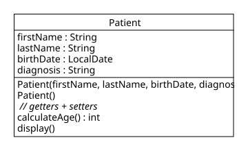

# UE_05.2 Konstruktoren - Übungen

[<<](../skriptum/05.2_Konstruktoren.md)

### UE_05.2_1: Patient mit Konstruktor

Erstelle folgende Klasse `Patient`:



Die Attribute sind privat und werden in den Konstruktoren initialisiert.  
Ein Konstruktor übernimmt alle Werte als Argumente.  
Der zweite Konstruktor setzt alle Attribute auf Standdardwerte.  
Für alle Attribute gibt es getter und setter.

Sowohl die Konstruktoren als auch die Setter sollen sinnvolle Validierungen enthalten, 
z. B. darf `dateOfBirth` nicht in der Zukunft liegen.
Wird die Validierung verletzt, 
soll eine `IllegalArgumentException` geworfen werden.

In einer `Main`-Klasse:
1. Erzeuge einen Patienten mit vollständigen Daten
2. Erzeuge einen Patienten ohne Angaben (parameterloser Konstruktor)
3. Gib beide mit einer `display()`-Methode aus

### UE_05.2_2: this vs. self

Gegeben ist folgender Java-Code:

```java
public class Medication {
    private String name;
    private double dosage;

    public Medication(String name, double dosage) {
        name = name;
        dosage = dosage;
    }

    public void display() {
        System.out.println(name + ": " + dosage + " mg");
    }

    public static void main(String[] args) {
        Medication m = new Medication("Ibuprofen", 400.0);
        m.display();
    }
}
```

1. Was wird dieses Programm ausgeben? (Teste es!)
2. Korrigiere den Konstruktor, sodass die Attribute korrekt gesetzt werden
3. Erkläre den Fehler

### UE_05.2_3: Befund-Klasse mit Validierung

Erstelle die Klasse `Finding` im Package `com.example.medical`:


Die Attribute sind privat.  
Füge einen Standardkonstruktor und mindestens 2 weitere Konstruktoren ein.  
Es gibt getter und setter für alle Attribute.

Im Konstruktor und in den settern wird geprüft, 
ob labValue negativ ist bzw. ob findingDate in der Zukunft liegt.
In beiden Fällen wird eine `IllegalArgumentException` geworfen.

[<<](../skriptum/05.2_Konstruktoren.md)
